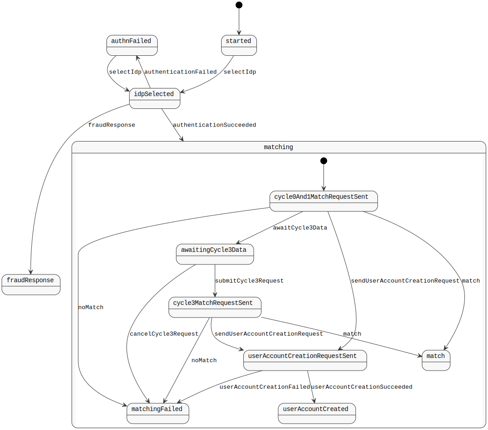

Verify Control
==============

> Thus we do disagreeable things, but we are *defensive*. That, I think, is still fair.

Usage
-----

1. `mvn clean install`
1. `java -jar target/hub.control-1.0-SNAPSHOT.jar server config.yml`
1. Visit `http://localhost:8080/healthcheck`

What is this?
-------------

A reimplementation of [alphagov/verify-hub#policy](https://github.com/alphagov/verify-hub/blob/master/hub/policy).

Statechart
----------

A statechart is automatically generated from [VerifySessionState.java](src/main/java/uk/gov/ida/hub/control/statechart/VerifySessionState.java):

Scope
-----

### In scope initially:

* All API endpoints should respond correctly
* User-facing behaviour should be identical to Policy
* Legal / Illegal state transitions should behave as they do in Policy
* Should support high availability (i.e. more than one instance running)

### Out of scope initially, but required for a working service:

* Reporting events to event sink
* eIDAS support

### Not implemented, of questionable value:

* Validating `assertionConsumerService` against a list of allowed URLs - this feature has no obvious value
* `forceAuthentication` - not clear if any of the services use this or if it's properly implemented
* Caching values for configuration in the session (e.g. `transactionSupportsEidas` - we can just look this up when we need it - should we bother keeping it in session?)

### No plans to implement:

* Exact replication of Policy's states
